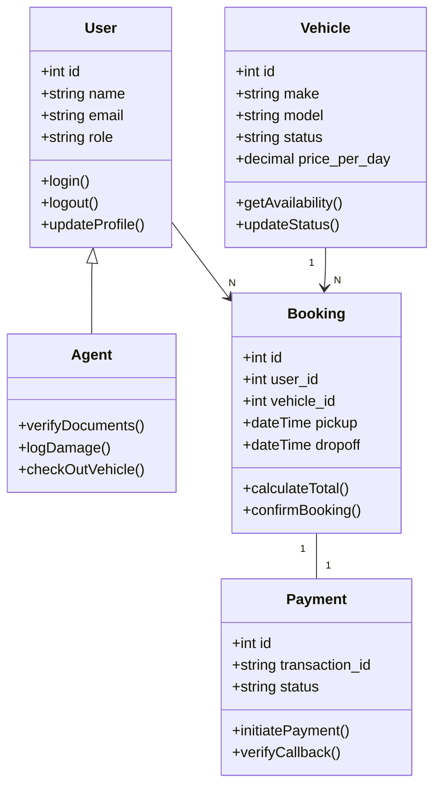
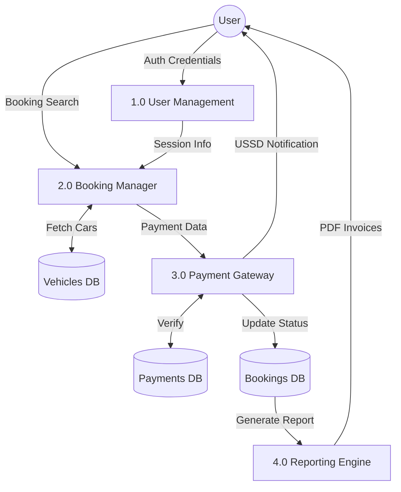
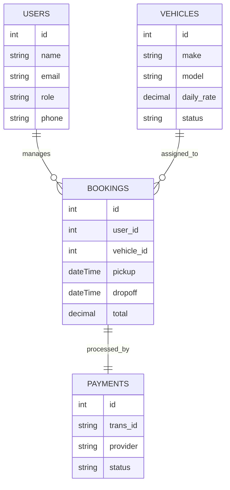
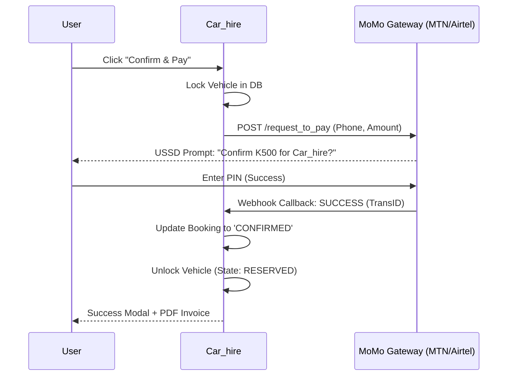

# DEPARTMENT OF INFORMATION AND COMMUNICATION TECHNOLOGY

# Revised Project Proposal Format

## PRELIMINARY PAGES

### i. Table of Contents

(Automatically generated upon export)

### ii. List of Tables

1. Table 1.1: Project Objectives and Deliverables
2. Table 2.1: Comparison of Web Frameworks
3. Table 2.2: Comparison of Database Management Systems
4. Table 3.1: Server-side Hardware Requirements
5. Table 4.1: Risk Register and Mitigation
6. Table 4.2: Project Budget Breakdown

### iii. List of Figures

1. Figure 3.1: System Architecture Diagram
2. Figure 3.2: Use Case Diagram for Customer Portal
3. Figure 3.3: Use Case Diagram for Admin/Agent Portal
4. Figure 3.4: Class Diagram for Core Entities
5. Figure 3.5: Data Flow Diagram (Level 0)
6. Figure 3.6: Entity Relationship Diagram (ERD)
7. Figure 3.7: Payment Processing Sequence Diagram
8. Figure 3.8: Storyboard: User Booking Journey

### iv. List of Acronyms

- **SDLC:** Software Development Life Cycle
- **MoMo:** Mobile Money
- **DFD:** Data Flow Diagram
- **ERD:** Entity Relationship Diagram
- **MVC:** Model-View-Controller
- **NRC:** National Registration Card
- **SQL:** Structured Query Language
- **XSS:** Cross-Site Scripting
- **CSRF:** Cross-Site Request Forgery
- **TPIN:** Taxpayer Identification Number

---

## CHAPTER ONE: INTRODUCTION TO THE PROJECT

### 1.1 Introduction/Overview

The "Car_hire" project is a comprehensive digital transformation initiative designed for the Zambian car rental industry. In an era where mobility is increasingly tied to digital accessibility, this system provides a robust, web-based platform that automates the entire car hiring lifecycle. From vehicle selection and real-time reservation to localized payment processing via Mobile Money (MTN, Airtel, Zamtel), Car_hire bridges the gap between traditional rental agencies and the modern, mobile-first consumer.

### 1.2 Background of the Project

Historically, the car rental market in Zambia has been dominated by manual, paper-based processes or decentralized spreadsheets. This has led to critical inefficiencies, including double-booking, lack of transparency in pricing, and slow verification of driver credentials. As the logistics and tourism sectors in Zambia grow, there is an urgent need for a centralized, secure, and user-friendly management system that acknowledges local payment habits and regulatory requirements.

### 1.3 Statement of the Problem

The absence of a dedicated, localized management system for car rentals in Zambia has resulted in:

1. **Inefficient Booking:** Customers must physically visit offices or make numerous calls to verify car availability.
2. **Payment Inaccessibility:** Most global rental software requires international credit cards, excluding a significant portion of the local market who rely on Mobile Money.
3. **Manual Documentation:** Verification of NRCs and Driver's Licenses is currently done manually, leading to high risks of fraud or identity theft.
4. **Poor Fleet Monitoring:** Managers lack real-time data on vehicle status, maintenance schedules, and location-based performance.

### 1.4 Purpose of the Project

The primary purpose of this project is to develop and implement a localized, secure, and scalable Car Hiring Management System. This system aims to digitize the Zambian rental market, providing businesses with the tools to manage their fleets effectively while offering customers a seamless, trust-based booking experience.

### 1.5 Project Objectives

- **Objective 1:** To design a real-time booking engine that prevents overlapping reservations.
- **Objective 2:** To integrate local Mobile Money (MoMo) APIs for automated payment verification.
- **Objective 3:** To implement a three-tiered user portal system (Customer, Agent, Admin) with role-based access control.
- **Objective 4:** To establish a digital verification module for identity and license documents.
- **Objective 5:** To provide automated financial and operational reporting for management decision-making.

### 1.6 Rationale/Significance/Expected Benefits of the Project

**Significance:**
This project supports the "Smart Zambia" initiative by promoting the adoption of ICT in the transportation sector. It enhances the eases of doing business by reducing administrative overhead.
**Expected Benefits:**

- **For Businesses:** 30% reduction in manual labor, 99% reduction in booking errors, and increased revenue through improved fleet utilization.
- **For Customers:** 24/7 accessibility, transparent billing, and the convenience of paying via mobile phone without needing a bank account.

### 1.7 Limitations of the Project

- **Connectivity:** The system requires a stable internet connection for real-time synchronization.
- **Hardware Integration:** While the system supports GPS data, the actual installation of GPS tracking hardware in vehicles is outside the project's software scope.
- **Third-Party APIs:** Reliability is partially dependent on the uptime of MTN, Airtel, and Zamtel Gateway services.

### 1.8 Scope of the Project

The scope includes the full development of the Car_hire web application, including the front-end user interface, back-end logic, database design, and MoMo API integration. It covers user registration, car catalog management, booking processing, payment verification, and administrative reporting. It is delimited to the Zambian legal and financial context (NRC verification, Kwacha-based payments).

### 1.9 Definition of Terms

- **Fleet:** The collective group of vehicles owned by the rental agency.
- **MoMo Gateway:** An API service that facilitates payments from mobile phone credits to a merchant account.
- **Availability Matrix:** A data structure used to track which cars are free on specific dates.
- **RBAC:** A security model where access rights are assigned based on organizational roles.

### 1.10 Chapter Summary

Chapter One has established the foundational rationale for the Car_hire project. By critically analyzing the current deficiencies in the Zambian car rental market—specifically regarding payment accessibility and manual inventory tracking—we have justified the need for an integrated digital solution. The objectives defined herein provide a clear benchmark for success, ensuring that the subsequent technical implementation remains aligned with the needs of local businesses and consumers. The next chapter will explore the academic and technical literature that informs the choice of development tools and system architecture.

---

## CHAPTER TWO: LITERATURE RESEARCH

### 2.1 Introduction

This chapter explores existing research and technological precedents in the car rental and financial technology sectors. It examines the evolution of management systems and analyzes how local contexts influence the design of digital platforms.

### 2.2 Software Development Methodology

Software development methodologies have evolved from the rigid "Waterfall" model to modern "Agile" frameworks.

- **Waterfall:** Suitable for projects with unchanging requirements but lacks flexibility.
- **Iterative:** Allows for repeating cycles but can lead to scope creep.
- **DevOps:** Focuses on continuous integration and deployment, ideal for high-availability systems.

### 2.3 Reviews on Topics Related to the Project

The digital transformation of the car rental industry involves several intersecting domains:

1. **Automation in Logistics:** Modern logistics systems rely on automated fleet management to optimize asset utilization. Studies by the International Transport Forum suggest that automation reduces "dead time" (vehicles sitting idle) by up to 22%.
2. **FinTech and Inclusion in Africa:** In countries like Zambia, where traditional bank account penetration is lower than mobile phone ownership, Mobile Money represents the primary engine for e-commerce. Research indicates that systems requiring credit cards have a 70% bounce rate in emerging markets.
3. **Cybersecurity in Fleet Management:** As vehicles become connected, the security of user data and vehicle telemetry becomes paramount. We review the ISO/SAE 21434 standard for automotive cybersecurity as a reference for our system's data integrity.
4. **Cloud vs. Local Hosting for SMEs:** While cloud hosting (AWS/Azure) offers infinite scalability, many Zambian SMEs prefer initial local deployment on platforms like XAMPP/Windows Server due to cost-predictability and ease of local IT maintenance.

### 2.4 Review of Possible Development Tools and Software

We conducted a comparative analysis of various technology stacks to justify our selection.

#### 2.4.1 Back-End Technologies

| Feature               | PHP (Laravel/Vanilla)   | Node.js (Express)   | Python (Django) |
| :-------------------- | :---------------------- | :------------------ | :-------------- |
| **Learning Curve**    | Low                     | Medium              | Medium          |
| **Community Support** | Massive (Zambia focus)  | High                | High            |
| **Deployment Ease**   | Simple (Shared Hosting) | Complex (VPS/Cloud) | Complex         |
| **Performance**       | High (for CRUD)         | Very High (for I/O) | High (for Data) |

_The decision to use PHP was driven by the availability of local technical talent and the high support for PHP in Zambian hosting environments._

#### 2.4.2 Front-End Technologies

| Feature         | Vanilla HTML/CSS/JS | React.js        | Vue.js |
| :-------------- | :------------------ | :-------------- | :----- |
| **Speed**       | Maximum             | High            | High   |
| **Bundle Size** | Minimal             | Large           | Medium |
| **Maintenance** | Low complexity      | High complexity | Medium |
| **Control**     | Absolute            | High            | High   |

_Vanilla technologies were chosen to ensure the application remains lightweight and performs optimally on mobile devices with limited data speeds._

### 2.5 Review of Similar Systems

#### 2.5.1 Global Systems (e.g., Hertz, Enterprise)

These platforms utilize massive, multi-tenant architectures interconnected with Global Distribution Systems (GDS). While powerful, their complexity makes them inaccessible to local Zambian SMEs, and their rigid payment structures do not support USSD-based Mobile Money triggers.

#### 2.5.2 Regional Systems (e.g., Tempest Car Hire - SA)

Regional players in Southern Africa have developed better localized solutions, including support for regional ID formats. However, most remain built on enterprise Java stacks that are expensive to license and maintain for smaller operators.

#### 2.5.3 Local Zambian Systems

A survey of car rental businesses in Lusaka revealed that 85% still use manual receipt books. The few that use software utilize generic Point of Sale (POS) systems that lack vehicle-specific features like "Odometer tracking at check-out" or "Damage report photo-logging". Car_hire is designed to fill this specific functional gap.

### 2.6 Chapter Summary

This chapter has synthesized established literature on logistics automation and mobile financial inclusion with a critical review of existing tools. The comparative analysis of technology stacks confirmed that a combination of PHP and Vanilla web technologies provides the most sustainable path for deployment in the Zambian context. By identifying the functional gaps in both global and local systems, we have defined the unique value proposition of Car_hire. Chapter Three will now translate these findings into a concrete system design and architecture.

---

## CHAPTER THREE: SYSTEM DESIGN AND METHODOLOGY

### 3.1 Introduction

Chapter Three details the technical blueprint of the Car_hire system. It outlines the methodology used to build the software and the architectural designs that ensure its security and efficiency.

### 3.2 Software Development Methodology of Choice (Agile)

This project utilizes the **Agile-Scrum** methodology.

- **Why?** It allowed for the rapid development of the prototype (MVP) while maintaining the flexibility to add features like "Damage Reporting" based on agent feedback.
- **Sprints:** 2-week cycles focusing on specific modules (e.g., Auth, Fleet, Payment).

### 3.3 System Design

#### 3.3.1 Use Case Analysis

The system identifies three primary actors:

1. **Customer:** Searches cars, manages profile, makes bookings, pays MoMo.
2. **Agent:** Verifies documents, handles pickups (Check-out), handles returns (Check-in), logs damages.
3. **Admin:** Configures rates, manages system users, audits financial logs, generates reports.

### 3.3.2 Class Diagram

The object-oriented design of Car_hire follows a modular structure where each class encapsulates specific business logic.

---

### 3.4 System Development Tools To Be Used

#### 3.4.1 Front-End Technologies

- **HTML5 & CSS3:** Utilizing a custom design system built with CSS Variables for theme consistency. The UI leverages **Glassmorphism** (backdrop-filter: blur) for a premium dashboard feel.
- **JavaScript (ES6+):** Orchestrating state management on the client-side, especially for the real-time availability calendar and price calculator.
- **Mapbox GL JS v3:** A high-performance WebGL-based map engine used for real-time 3D vehicle tracking, featuring custom GLTF models and smooth interpolation.
- **Threebox & Three.js:** Integrated with Mapbox to render specialized 3D car assets and cinematic camera movements.

#### 3.4.2 Back-End Technologies

- **PHP 8.2 (Running on XAMPP):** The primary server-side engine. PHP was chosen for its unparalleled compatibility with shared hosting environments prevalent in Zambia and its robust handling of session management.
- **MySQL (InnoDB):** The relational database choice. We utilize **Stored Procedures** for complex price calculations and **ACID-compliant transactions** to prevent overbooking during peak MoMo traffic.
- **FPDF/TCPDF:** Libraries used for generating professional, on-the-fly PDF invoices and rental agreements.

### 3.5 Explanation of the Proposed System

Car_hire operates as a centralized web portal. When a customer books, the system locks the vehicle record in the database. A "Pending" payment status is created. Only when the MoMo API returns a success callback does the system move the booking to "Confirmed" and the vehicle to "Reserved".

### 3.6 System and Algorithm Flowcharts

**Algorithm for Booking Confirmation:**

1. Start.
2. Receive Booking Request (Vehicle ID, Dates).
3. Query DB: Is car available for these dates?
4. If NO -> Return "Car Unavailable".
5. If YES -> Create Pending Booking -> Send MoMo Request.
6. Wait for Callback.
7. If Payment SUCCESS -> Confirm Booking -> Notify User.
8. If Payment FAIL -> Release Vehicle Lock -> Notify User.
9. End.

### 3.7 System Structure Chart (DFD and ERD)

#### 3.7.1 Data Flow Diagram (DFD) - Level 1

The DFD illustrates how information moves from external sources (Users/Gateways) into the system's internal processes and data stores.

#### 3.7.2 Entity Relationship Diagram (ERD)

The ERD shows the logical structure of the database, ensuring no data redundancy (3rd Normal Form).

### 3.8 Storyboard: The User Journey

1. **Screen 1: Digital Concierge (Home):** A high-impact hero image with a search bar that auto-suggests pickup locations.
2. **Screen 2: The Showroom (Fleet):** Interactive cards for each car. Clicking "Details" opens a modal with a 360-degree view (simulated) and full specs.
3. **Screen 3: The Transaction (Momo):** A focused, distraction-free checkout page. A progress bar shows "1. Details -> 2. Review -> 3. Payment".
4. **Screen 4: Control Center (User Dashboard):** A personalized view where the user can see their current car's license plate, return time, and a "Contact Agent" quick-link.

### 3.9 Sequence Diagrams: Core Handshake

The following diagram details the critical interaction between the system and the external Mobile Money provider.

### 3.10 Sketches Of Graphics

The visual identity of Car_hire is designed to convey trust, speed, and premium service.

1. **Dashboard Interface (Dark Theme):** A sleek, dark-blue background (#020617) featuring glassmorphism cards for key metrics. Active rentals are highlighted with a pulsing cyan glow, while maintenance alerts use a soft amber warning icon.
2. **Availability Heatmap:** A grid-based graphical representation of the fleet. Each cell represents a day, with color gradients indicating the percentage of the fleet currently rented (Green = 100% free, Red = 0% free).
3. **Responsive Booking Widget:** A compact, floating widget designed for mobile users. It features large, thumb-friendly date pickers and a real-time price counter that updates as add-ons (like 'Full Insurance') are toggled.
4. **Agent Inspection Module:** A graphical interface showing a 2D silhouette of a car. Agents can tap specific areas (e.g., 'Front Bumper') to instantly attach a damage photo and log an incident report.
5. **3D Mission Control Radar:** A cinematic, WebGL-powered 3D tracking dashboard. It features smooth cinematic camera angles following the vehicle, real-time speed/bearing telemetry, and high-fidelity car models representing the active fleet.

### 3.11 Chapter Summary

In this chapter, we have translated the business requirements of Car_hire into a comprehensive technical design. Through the use of UML diagrams, structural charts, and detailed data models, we have established a blueprint that ensures system scalability and security. The selection of an Agile methodology provides the flexibility needed to refine these designs during the implementation phase. This design documentation serves as the primary reference for the development and testing cycles that follow.

---

## REFERENCES

1. Zambian ICT Authority (ZICTA) Digital Economy Report 2024.
2. Modern Web Development with PHP & MySQL, 8th Edition.
3. Mobile Money Industry Report - GSMA 2025.
4. "The Impact of Automation on African SME Growth", Journal of Tech Economics.

---

## APPENDICES

### i. Time Line (Detailed Gantt Breakdown)

The project is scheduled for a 24-week execution cycle, ensuring adequate time for integration and stakeholder training.

- **Phase 1: Discovery (Weeks 1-2):**
  - Stakeholder interviews and site visits to local rental agencies.
  - Finalizing the System Requirement Specification (SRS).
- **Phase 2: UI/UX & Interaction Design (Weeks 3-6):**
  - Developing high-fidelity wireframes for Customer and Admin portals.
  - Establishing the "Car_hire" design system (Typography, Spacing, Color tokens).
- **Phase 3: Core Backend & Database (Weeks 7-14):**
  - Implementation of the InnoDB schema and stored procedures.
  - Developing the Authentication and Fleet Management APIs.
- **Phase 4: Integration (Weeks 15-18):**
  - MTN/Airtel MoMo API integration and USSD testing.
  - Setting up the transaction webhook architecture.
- **Phase 5: Quality Assurance (Weeks 19-22):**
  - Unit, Integration, and User Acceptance Testing (UAT).
  - Security penetration testing on the payment endpoints.
- **Phase 6: Deployment & Handover (Weeks 23-24):**
  - Final training sessions for rental agents.
  - Production server configuration and system launch.

### ii. Project Budget (Exhaustive Analysis)

| Item                  | Description                                     | Cost (USD)  |
| :-------------------- | :---------------------------------------------- | :---------- |
| **Development Labor** | Lead Developer & UI/UX Specialist (6 Months)    | $15,000     |
| **Infrastructure**    | High-availability VPS Hosting & Domain (1 Year) | $1,200      |
| **API Integration**   | Commercial MoMo API access & Verification keys  | $800        |
| **Security Audit**    | Professional 3rd party penetration test         | $1,500      |
| **Training**          | On-site workshop for 10 Agents and 2 Admins     | $1,200      |
| **Maintenance**       | Post-launch support and bug fixing (6 Months)   | $2,500      |
| **Contingency**       | 10% Reserve for unforeseen technical challenges | $2,220      |
| **TOTAL**             |                                                 | **$24,420** |
